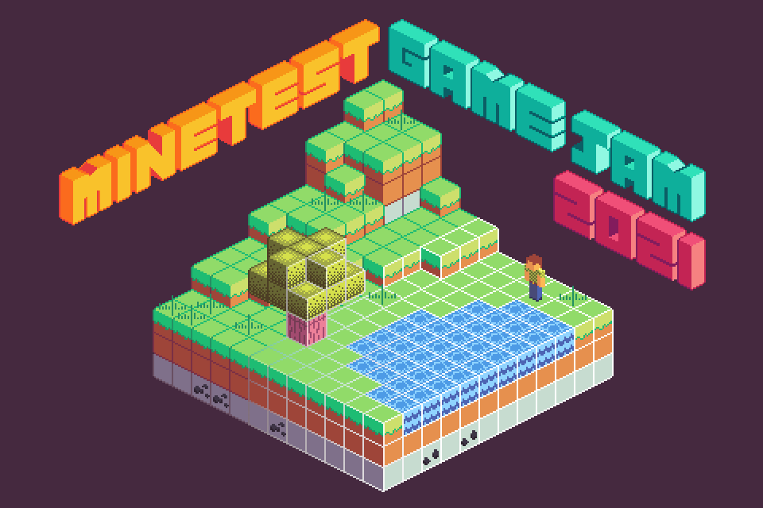

Announcing ... \*drumroll\* ... the **2021 Minetest GAME JAM**!  

This is the first "legit" game jam for the Minetest community, and we hope it brings a few new games to the collection. We also hope it goes well enough to host more of these in the future!  

[Why](#why-should-i-be-excited) | [What](#what-do-i-do) | [When](#when-is-it-happening) | [How](#how-do-i-participate) | [Ratings](#rating-and-scoring) | [Prizes](#what-will-i-win) | [Judges](#who-are-the-judges) | [Who](#whos-in-charge-of-this-thing)

## Why should I be excited?
* Sharpen your game making skills!
* Play new games made by the community!
* **[Money prizes!](#what-will-i-win)**
* It's fun, right???
* It's easy!

## What do I do?
Your goal is to **make a _small_, complete, self-contained game experience**.  

Some examples of the size of game we are looking for:
* https://content.minetest.net/packages/Hume2/boxworld3d/
* https://content.minetest.net/packages/Just_Visiting/labyrinth/
* https://content.minetest.net/packages/1248/labyrinthus/

The goal is to make a small game, not an immersive sandbox or an emergent RPG. Choose a simple, manageable idea, and divide your time wisely.  

Need game ideas? How about:
* Racing game
* Farming simulator
* I Spy (or Where's Waldo?)
* Business simulation (tycoon game)
* Tower defense
* Battleship (or another board game)

## When is it happening?
_(All dates are 00:00UTC)_  
* The game jam starts **December 1st**.  
* Development time ends **December 21st**.
* Rating begins immediately after, and ends **December 30th**.
* Results will be totaled and announced **December 31st** (or Jan. 1st).

## How do I participate?
Simple: Submit a game to [the Content Database](https://content.minetest.net/) by the deadline with the `Jam / Game 2021` tag.  
If you are on a team, choose one person to submit your package. **Make sure to list all your team members!**  
Only **one submission** will be counted **per participant** (the last one submitted). You could be on multiple teams and by yourself to have multiple submissions.  

The tag will not be available until December 1st! Releases made before December 1st will be disqualified!  
Packages will be held until work time ends and then approved to open for ratings.  

### Rules
* Game must be created entirely within allotted time-frame
  * You should **not** be building off of an existing game (like MTG)
  * Pre-made libraries/assets **must be documented** somewhere
* Third-party libraries and assets may be used, but core gameplay must be own work
  * You **must document** which content is made by you and which is not (can use licenses to document)
  * We **highly recommend** using git submodules for third-party libraries
* Teams are allowed (any size allowed, participants may participate in multiple teams and individually)
* Submissions must follow [CDB Guidelines](https://content.minetest.net/policy_and_guidance/)
* Game must be compatible with latest stable version at start of the jam (Dec. 1st, 5.4.1)
* CDB Packages must be tagged appropriately (event tag)
* Participants found unfairly influencing reviews will be **immediately disqualified**, but their package (if submitted) may remain as a regular CDB package

## Rating and Scoring
On **December 21st** all submissions will be approved (if they meet CDB guidelines) and opened for playing/rating.  

### Your Job
Play and review submission with the [event tag](#). Your +1/-1 will contribute to the community score for each package.  

### Our Job
A [panel of judges](#who-are-the-judges) will also score each package. This will be combined with the community score and objective rubric to produce a final score.  

Here are some subjective things you should keep in mind that the judges may be looking for.  
| Criteria      | Description                                                                                                     |
| ------------- | --------------------------------------------------------------------------------------------------------------- |
| Innovation    | What's different about your game? Are the mechanics new and clever? Is there unexpected gameplay?               |
| Gameplay      | How intuitive is your gameplay? Is it a fun one-sitting game or hours of emergent gameplay? Is it captivating?  |
| Content       | Is your game super polished? Or is there a lot to explore?                                                      |
| Audio/Visuals | Did you make beautiful art or music? Is the game style cohesive? Can you charm anyone with your programmer art? |
| Stability     | How well does your game run? Are there any unexpected crashes? Are there any warnings in the console?           |

### Wait, objective rubric?
These are bonus criteria that will add to your score. Not completing these will probably harm your package in the final rankings.    

| Criteria                                                                                                             | Bonus |
| -------------------------------------------------------------------------------------------------------------------- | ----- |
| **The game is stable enough to play.**                Any bugs or crashes should not hinder main gameplay.        | 5%    |
| **Package has a public <ins>git</ins> repository.**   Mercurial is cool, but we use git in this house.            | 3%    |
| **The game works out-of-the-box.**                    No extra configuration, external programs, or trusted mods. | 2%    |

For more info on how scoring works, see [the full details](PLANNING.md#scoring).  

## What will I win?
Bragging rights! A cool game! Oh, and some money!  
The **top 3** winners will win portions of the prize pool.  

_Current Prize Pool:_ **$500**

Portions are subject to change, but you can expect roughly 50%/30%/20% for 1st/2nd/3rd.  
Winners will be contacted for payment address (PayPal account, charity, or other participant).  

**PayPal is required to receive prize funds.** This is mostly for international and accessibility reasons. Alternatives may be suggested at payout, but will only be used at handler's convenience. Crypto will not be considered.  

For more details on prize handling (ties, teams, etc.) see [full details](PLANNING.md#prizes).  

* * *

The prize pool is funded by community contributions. Those that wish to contribute should contact GreenXenith (via [forum](https://forum.minetest.net/ucp.php?i=pm&mode=compose&u=18711), Discord @ GreenXenith#3232, or [Reddit](https://www.reddit.com/message/compose/?to=GreenXenith)).  

Current contributors:  
* MisterE
* MinetestVideos
* cupOjoseph
* GreenXenith

### Disclaimer
By participating and/or contributing, you understand and accept that prize money will be aggregated and distributed by a private third-party (GreenXenith) through a secondary proprietary third-party service (PayPal) to you (the contestant) or the destination of your choice, at the discretion of the private handler (GreenXenith). 

## Who are the judges?
* Benrob0329
* celeron55
* GreenXenith
* Hugues Ross
* Krock (SmallJoker)
* MinetestVideos (Nathan Salapat)
* MisterE
* rubenwardy
* sfan5
* Warr1024

## Who's in charge of this thing?
Me (GreenXenith), though it is the brainchild of MisterE.  
Myself, my Discord staff, and a few other community members (rubenwardy, MisterE, MinetestVideos, ElCeejo) helped plan and flesh out the event details.  

* * *

If you have any questions, ask here or in response to any other announcement on other platforms!  

* * *

A mirror of this page is held on the [Minetest Forums](https://forum.minetest.net/viewtopic.php?f=3&t=27512) and on the [Minetest Subreddit](https://www.reddit.com/r/Minetest/comments/qzvd3o).  

A copy of this page is held in the [data repository](https://github.com/GreenXenith/minetestgamejam). All relevant documents, details, and other information are in this repository.  
