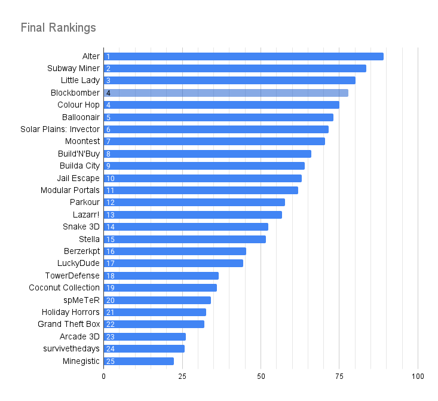
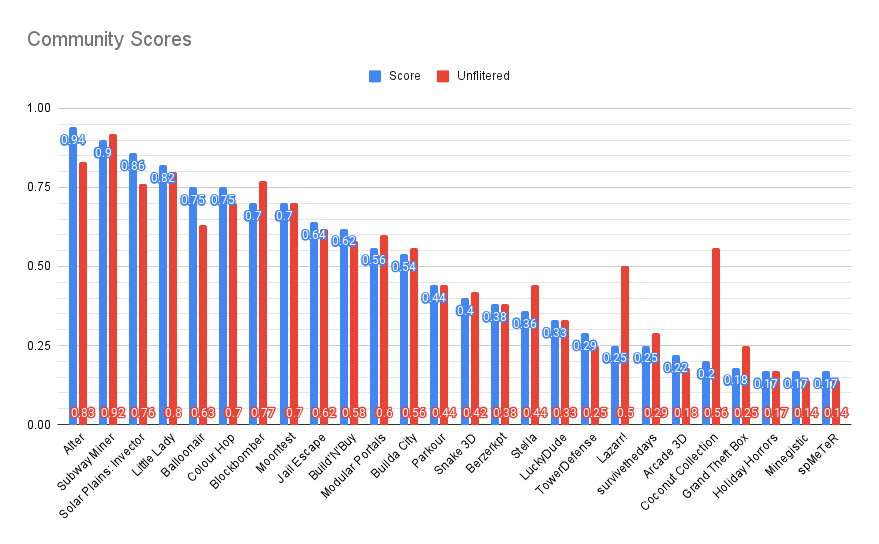
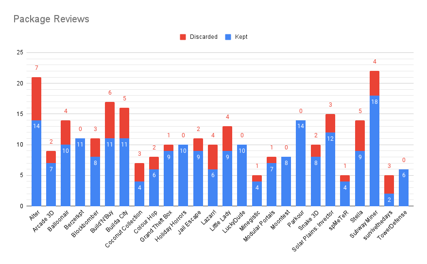
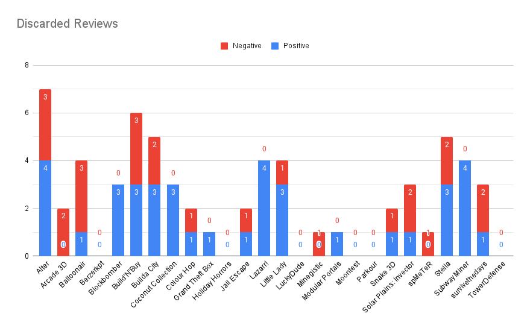
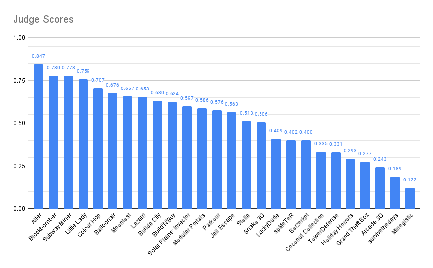
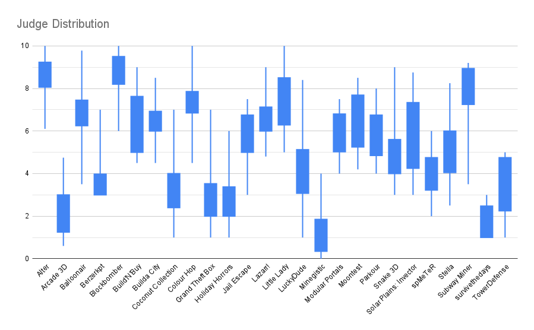
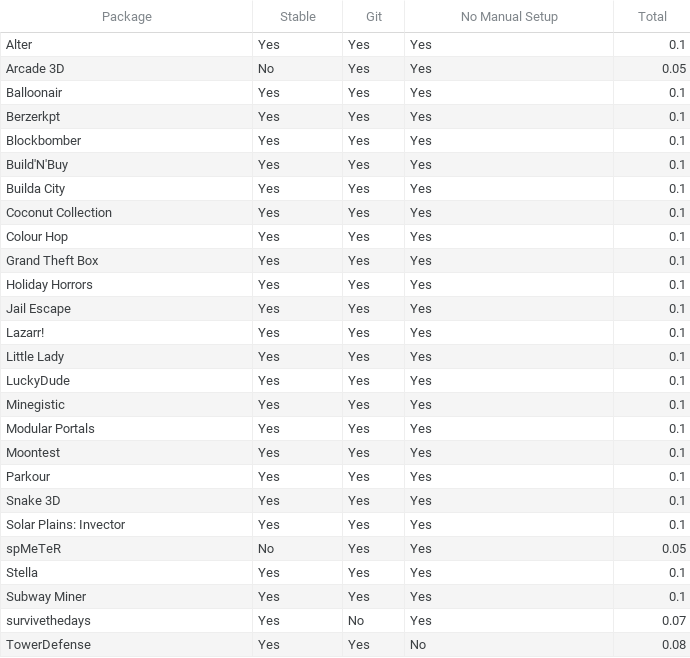
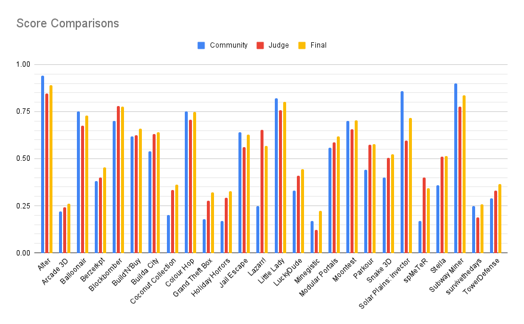

# 2021 Minetest GAME JAM Results
- [2021 Minetest GAME JAM Results](#2021-minetest-game-jam-results)
  - [Community Ratings](#community-ratings)
  - [Judge Scores](#judge-scores)
    - [Judge Notes](JUDGE_NOTES.md)
  - [Objective Rubric](#objective-rubric)
  - [Final Scores](#final-scores)

**1st** place: [**Alter** by **yaman**](https://content.minetest.net/packages/yaman/alter/) ($360)  
**2nd** place: [**Subway Miner** by **AFCM**](https://content.minetest.net/packages/AFCM/subway_miner/) ($216)  
**3rd** place: [**Little Lady** by **Just_Visiting/ExeVirus**](https://content.minetest.net/packages/Just_Visiting/littlelady/) ($144)  

## Community Ratings
Community reviews are turned into a ratio of `Positive Reviews / Total Reviews`, with 1 artificial positive and negative review to balance lesser-reviewed packages.
Reviews with more unhelpful votes than helpful votes are not counted in the ratio. [community.js](community.js) contains the code used to pull and calculate community scores.

_Community Scores_

_Community Reviews_

_Discarded Reviews_

## Judge Scores
Judge scores are initially between 0 and 10 (inclusive) and later converted to a percentage. Some judges have also [provided detailed feedback](JUDGE_NOTES.md) on many of the games.

_Judge Scores_

_Judge Distribution (10 judges)_  
_[How to Read a Box Plot](https://www.statisticshowto.com/probability-and-statistics/descriptive-statistics/box-plot/)_

## Objective Rubric
The objective rubric includes 3 criteria:
* `Stable` (+0.5): The game has no easily reproducable crashes hindering **intended** gameplay.
* `Git` (+0.3): The game has a public git repository.
* `No Manual Setup` (+0.2): The game handles all initial setup automatically (first-time kick is fine).

_Objective Rubric_

## Final Scores
The final scores are a combination of community ratings (30% weight), judge scores (60% weight), and the objective rubric (10% of score).

_Final Scores_  
_Includes unfiltered community reviews for comparison_

_Score Comparisons_

