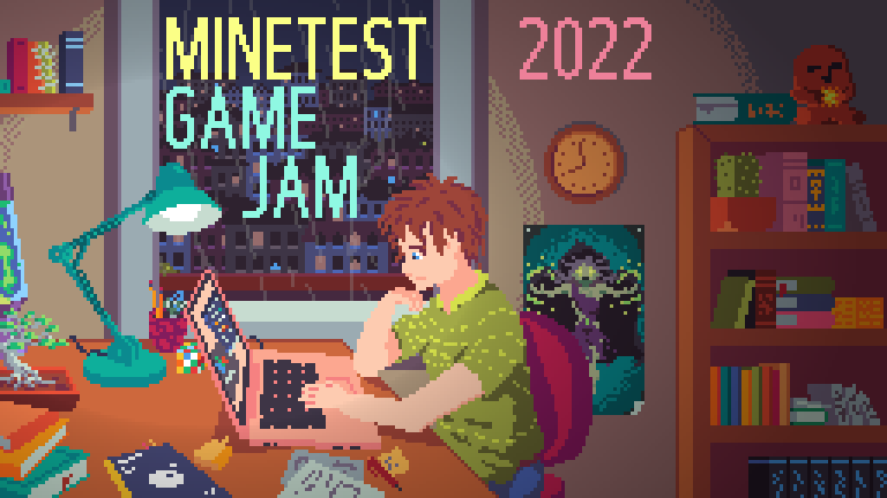

The **Minetest GAME JAM** is BACK for 2022!  

We are trying out an 11-month schedule for the convenience of those that may not be able to participate during certain months!  

Once again you will have the opportunity to compete and sharpen your gamedev skills for the chance at some cash prizes! And hopefully have some fun too...

## Theme

???, ???, ??? (TBA)

## Info Site
_Details coming soon..._

## What do I do?
Your mission (should you choose to accept it) is to create a game in 3 weeks using the Minetest Engine following a theme (to be announced).  

Check out [some submissions from the last jam](https://content.minetest.net/packages/?q=&page=1&tag=jam_game_2021) for some examples!  

## When do I do it?
_(All times are UTC)_
* The jam starts **Tuesday, November 1st @00:00**
* You have until **Monday, November 21st @23:59** to make your game
* Rating will run until **Monday, November 28th @23:59**
* Results will be announced some time **Wednesday, November 30th**

## How do I do it?
Super easy! Make a Minetest game using the announced theme and submit it to [the Content Database](https://content.minetest.net/) before the deadline using the `Jam / Game 2022` tag.  

Want some help? Get a team together to spread the load! Choose one person to submit the game and list all your team members.  

Note, only the **most recent submission** will be counted for each **individual**. You could be on multiple teams and/or by yourself if you want to make more games (good luck...)

The theme consists of 3 words and will be announced when the jam starts. The ContentDB tag will also become available.  

### Rules
* Make your game _within_ the timeframe
  * You should build your game essentially from scratch, or a very minimal base
  * You may use third-party libraries (we recommend using git submodules) and assets, provided you document and properly attribute them
* Your game must comply with [ContentDB Policies](https://content.minetest.net/policy_and_guidance/) and be tagged appropriately (event tag)
* Your game must be compatible with the current stable version at the start of the jam (Nov. 1st, 5.6.1)
* Games should follow the `gamename_modname` prefix-style for mod names (libraries exempt)

## Community Voting and Judge Scoring
This time the top 3 placing winners will be determined through judge scoring only. A **Community Winner** will be chosen by you (you!) through ContentDB reviews.  

### Your Job
Begin playing other games on **November 22nd** and leave a ContentDB review. This will contribute to each package's community score.  

### Our Job
A panel of judges will once again score each package. They will score each package out of 10 points however they please, but you can generally expect them to look for:
* Gameplay: How intuitive and enjoyable is your gameplay? Is it a fulfilling experience? Is there a clear goal or ending?
* Innovation: What makes your game unique? Do you have emergent mechanics or clever gameplay?
* Content: Is your game well-polished or packed with stuff to do? Is the art and sound consistent and cohesive?
* Theme: How well does your game utilize the theme(s)? Did you apply the theme(s) in a clever way?

**Another** 10 points will be awared for meeting criteria on the "Bonus" Rubric. Not completing these is a **huge disadvantage**.
* Your game should be **stable enough to complete the intended goal** (**+5**)
* Your game **works out of the box** (no external applications or out-of-game configuration) (**+3**)
* Your game **has a public git repository** (**+2**)

Your game will be scored out of **20 total points**.  

## What will I win?
Another sweet product to put on your dev portfolio! And some cash I guess...  

This time the prize pool will be capped at **$600**. Contributions beyond this point will be politely declined. The current total will remain private.  

**[CURRENTLY ACCEPTING CONTRIBUTIONS]**

The top 3 winners will recieve 1/2, 1/3, and 1/6 of the prize pool for 1st, 2nd, and 3rd places, respectively. Winners will be contacted for payment destination (PayPal account, charity, or other participant).  

The top 3 winners and the Community Winner submissions will also be promoted on the ContentDB front page!

Other prizes TBD???

---

**PayPal is still required to receive prize funds.** This is for international and accessibility reasons. Alternatives may be suggested at payout, but will only be used at handler's convenience. Crypto will **not** be considered.

For more details about prize handling (ties, teams, etc.) see [full details](PLANNING.md#prizes).  

---

The prize pool is once again funded by community contributions. Those that wish to contribute should contact GreenXenith via [forum](https://forum.minetest.net/ucp.php?i=pm&mode=compose&u=18711), Discord @ GreenXenith#3232, or [Reddit](https://www.reddit.com/message/compose/?to=GreenXenith).  

Contributors:
* MisterE
* GreenXenith

### Disclaimer
By participating and/or contributing, you understand and accept that all involved funds will be aggregated and distributed by a private third-party (GreenXenith) through a proprietary third-party service (PayPal) to you (the contestant) or the destination of your choice, at the complete discretion of the private handler (GreenXenith).  

## Who are the Judges
_List will expand_

* ExeVirus
* GreenXenith
* MisterE
* Warr1024

If you were a judge previously and are interested again, please contact GreenXenith.  

## Who is Running this Show?
Me (GreenXenith) with input and assistance from the Minetest Discord staff and a few Minetest community members (rubenwardy, Warr1024, MisterE, and others).

---

Check out the [planning document](https://github.com/GreenXenith/minetestgamejam/blob/master/2022/PLANNING.md) first if you have questions. Otherwise, feel free to ask here or on any of the relevant platforms.

---

A copy of this page is held in the [data repository](https://github.com/GreenXenith/minetestgamejam/blob/master/2022/). All relevant documents, details, and other information are in this repository.
